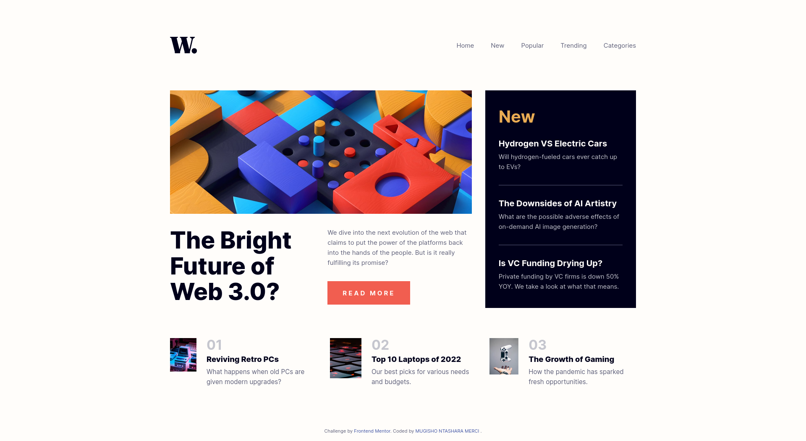
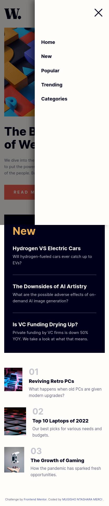

# Frontend Mentor - News homepage solution

This is a solution to the [News homepage challenge on Frontend Mentor](https://www.frontendmentor.io/challenges/news-homepage-H6SWTa1MFl). Frontend Mentor challenges help you improve your coding skills by building realistic projects.

## Table of contents

- [Overview](#overview)
  - [The challenge](#the-challenge)
  - [Screenshot](#screenshot)
  - [Links](#links)
- [My process](#my-process)
  - [Built with](#built-with)
  - [What I learned](#what-i-learned)
- [Author](#author)

## Overview

### The challenge

Users should be able to:

- View the optimal layout for the interface depending on their device's screen size
- See hover and focus states for all interactive elements on the page
- Toggle the mobile menu and see a smooth transition alongside a customized overlay backdrop.

### Screenshot

**Desktop Design:**



**Mobile Design:**



### Links

- Solution URL: [GitHub Repository](https://github.com/Mugisho-dev-metasploit/News-homepage-challenge-on-Frontend-Mentor-04)
- Live Site URL: [Live Demo](https://mugisho-dev-metasploit.github.io/News-homepage-challenge-on-Frontend-Mentor-04/)

## My process

### Built with

- Semantic HTML5 markup
- CSS custom properties (Variables)
- Flexbox
- CSS Grid
- Mobile-first workflow
- Vanilla JavaScript (for menu interactions and loading animations)

### What I learned

During this project, I strengthened my ability to reproduce a complex, professional layout using **CSS Grid** and **Flexbox** together. I also added JavaScript to handle a smooth sliding off-canvas mobile navigation menu.

Some CSS and JS highlights I am proud of:

```css
/* Smooth animation for page loading */
@keyframes fadeInSlideUp {
  from {
    opacity: 0;
    transform: translateY(15px);
  }
  to {
    opacity: 1;
    transform: translateY(0);
  }
}

.fade-in-on-load {
  opacity: 0;
  animation: fadeInSlideUp 0.8s ease-out forwards;
}
```

```js
// Handling the Off-Canvas Mobile Menu
function openMenu() {
  mainNav.classList.add("active");
  menuOverlay.classList.add("active");
  document.body.style.overflow = "hidden"; // Locks body scroll
}
```

## Author

- Name - **MUGISHO NTASHARA**
- Frontend Mentor - [@mugisho-dev-metasploit](https://www.frontendmentor.io/profile/mugisho-dev-metasploit)
- Upwork Profil - [MUGISHO NTASHARA MERCI](https://www.upwork.com/freelancers/~01a2f97f4e3bb50a4c?mp_source=share)
- GitHub - [Mugisho-dev-metasploit](https://github.com/Mugisho-dev-metasploit)
